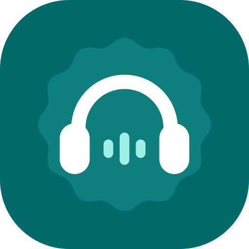
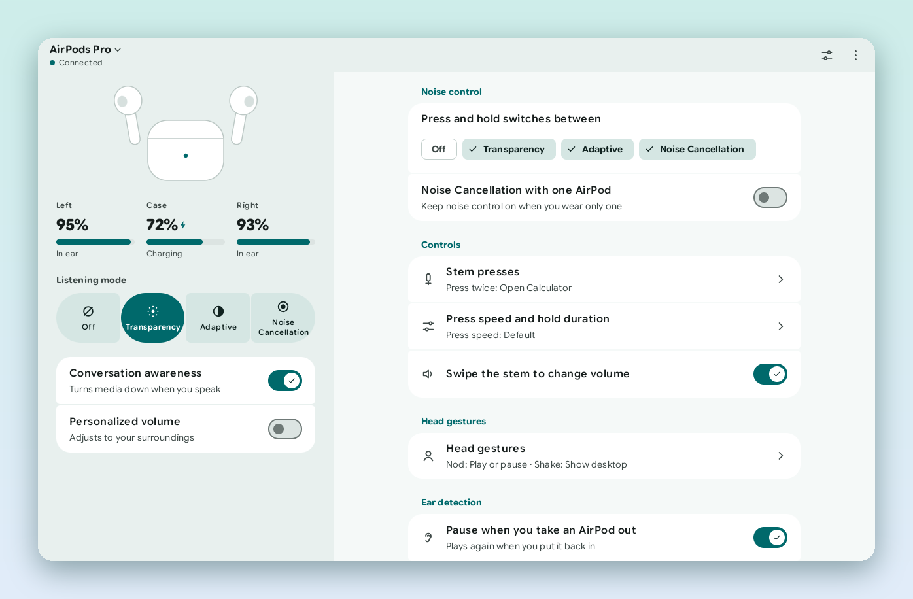
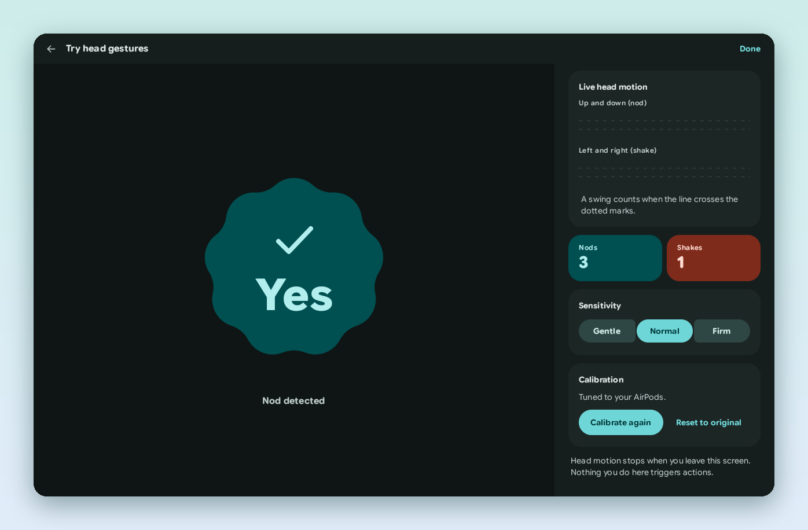
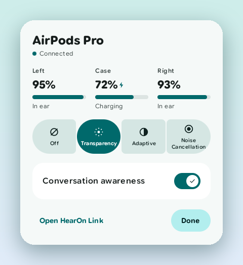
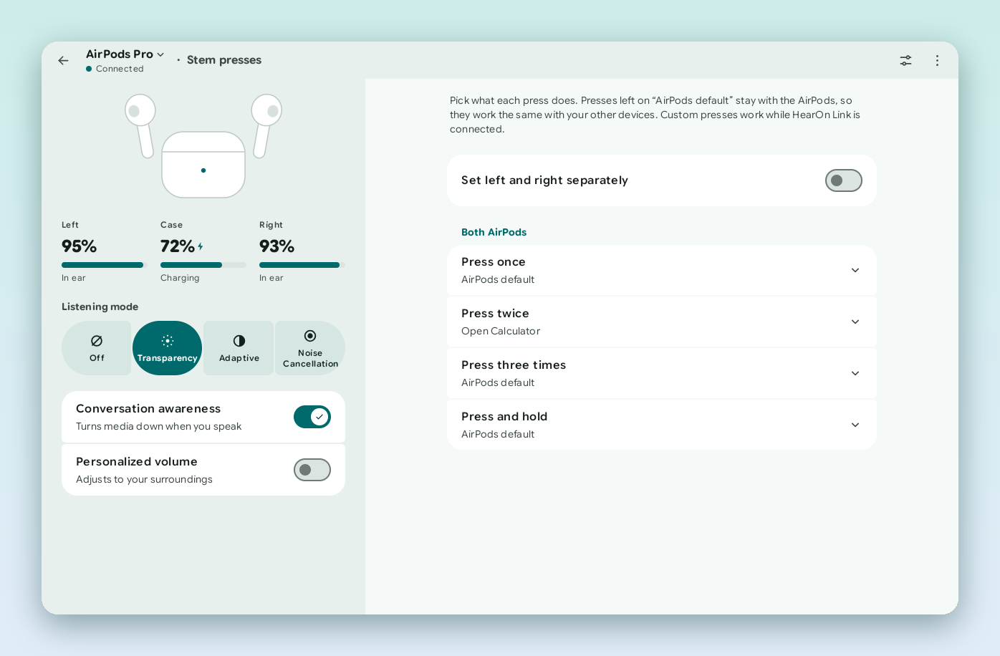
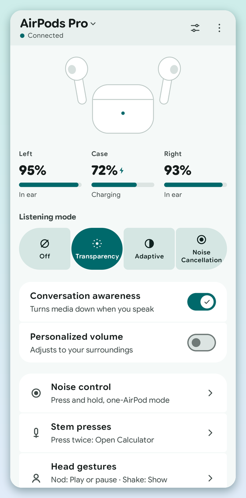
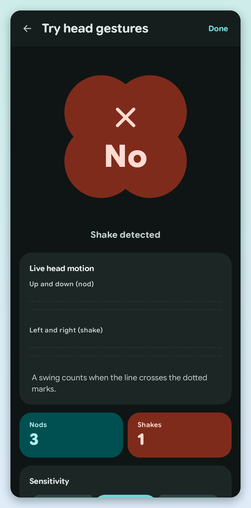
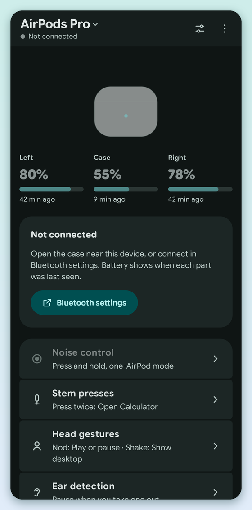

<p align="center">
  
</p>

<h1 align="center">HearOn Link</h1>

<p align="center">
  <b>Your AirPods, at home on a Googlebook.</b><br>
  Battery for each bud and the case, noise control, conversation awareness, stem presses that show
  the desktop or open an app, and head gestures: nod for yes, shake for no.
</p>

<p align="center">
  <a href="../../releases/latest/download/HearOnLink.apk"><b>⬇ Download HearOnLink.apk</b></a>
  &nbsp;·&nbsp; <a href="#install">Install</a>
  &nbsp;·&nbsp; <a href="#what-your-airpods-get">Features</a>
  &nbsp;·&nbsp; <a href="#privacy">Privacy</a>
  &nbsp;·&nbsp; <a href="CHANGELOG.md">What's new</a>
</p>

<p align="center">
  
  
  
  
  
  
</p>

<p align="center"><sub>A personal hobby project by <a href="https://github.com/kuscher">Alexander Kuscher</a>, proudly developed entirely on a Googlebook.
Not affiliated with or endorsed by any employer, or by Apple (<a href="#about-this-project">more</a>).</sub></p>

<p align="center">
  
</p>

## What it does

AirPods work on any Android device as Bluetooth headphones, but everything that makes them nice
lives in Apple's settings. HearOn Link talks to your AirPods the way an iPhone or Mac does, over
their own control channel, and brings those settings to your Googlebook and your Android phone.
No root, no account, no internet.

- **Battery for each part.** Left, right and case, with charging, in the app, the Quick Settings
  tile, a quiet notification and a home-screen widget. When a part stops reporting (a bud back in a
  closed case, the case on its own), HearOn Link shows its last level with how long ago it was seen,
  and the case's own Bluetooth adverts fill in 1 % levels whenever you open it nearby.
- **Listening modes.** Off, Transparency, Adaptive and Noise Cancellation in one tap, plus which
  modes a press-and-hold switches between, Adaptive's "less or more noise" slider and Noise
  Cancellation with one AirPod.
- **Conversation awareness and personalized volume.** Turn them on or off; while you talk,
  HearOn Link lowers what's playing, then brings it back.
- **Ear detection.** Pause when you take an AirPod out, play again when it goes back in (only if
  HearOn Link paused it), pause when you fall asleep.
- **Stem presses, your way.** Press once, twice, three times or hold, for both buds or each on its
  own: play or pause, next, previous, switch noise control, volume, voice assistant, **Show
  desktop**, or **Open an app** you pick. Presses you leave on "AirPods default" stay with the
  AirPods, so they work the same with your other devices.
- **Head gestures.** Try them in a live demo that says Yes or No, calibrate them to your own head,
  and turn on "anytime" to map a nod and a shake to actions (shake to show the desktop, for example).
  On phones, nod to accept a call and shake your head to decline.
- **Everything else the AirPods report.** Press speed and hold duration, volume swipe, call
  controls, which bud's microphone to use, tone volume, case sounds, custom EQ, optimized charging,
  renaming, and model, firmware and serial numbers. Heart rate and hearing protection on AirPods Pro 3.

<p align="center">
  
  <br><sub>The head-gesture demo: nod and the shape turns into a Yes, shake and it's a four-leaf No.</sub>
</p>

## Made for the Googlebook

- **One calm window.** Your AirPods sit on the left (battery, listening mode, the main switches)
  and settings on the right. The window's own title bar is painted to match the header just below
  it; nothing floats over the content.
- **Quick Settings.** The tile shows the listening mode and battery. A tap opens a small panel
  with the essentials; a long-press opens HearOn Link.
- **Starts on its own.** You pick your AirPods once in Android's own device picker. From then on
  HearOn Link wakes up when they connect, without a battery-optimisation exception.
- **Stem presses and head gestures for the desktop.** Show the desktop or open any app from a
  press or a shake of the head, without an accessibility service: Android allows it for the
  AirPods you picked in its own device picker.
- **A notification with three numbers.** Left, right and case as Android 17 metrics, with
  one-tap listening modes.

<p align="center">
  
  &nbsp;&nbsp;
  
  <br><sub>The Quick Settings panel, and stem presses with a press twice to open the calculator.</sub>
</p>

**On phones** it's the same app in one column, with pages for each group of settings.

<p align="center">
  
  &nbsp;
  
  &nbsp;
  
</p>

## What your AirPods get

HearOn Link shows only what your AirPods report they support.

| | AirPods 2 | AirPods 3 | AirPods 4 | AirPods 4 ANC | Pro | Pro 2 | Pro 3 | Max |
|---|---|---|---|---|---|---|---|---|
| Battery, rename, details | ✓ | ✓ | ✓ | ✓ | ✓ | ✓ | ✓ | ✓ |
| Ear detection | ✓ | ✓ | ✓ | ✓ | ✓ | ✓ | ✓ | |
| Stem presses | ✓ | ✓ | ✓ | ✓ | ✓ | ✓ | ✓ | |
| Listening modes | | | | ✓ | ✓ (no Adaptive) | ✓ | ✓ | ✓ (no Adaptive) |
| Conversation awareness, Adaptive | | | | ✓ | | ✓ | ✓ | |
| Personalized volume | | | ✓ | ✓ | | ✓ | ✓ | |
| Head gestures | | ✓ | ✓ | ✓ | | ✓ | ✓ | |
| Heart rate, hearing protection | | | | | | | ✓ | |

Beats with an Apple chip get whatever they report too. The feature table comes from public
protocol research; the app follows what your own AirPods say.

**What it can't do.** Some things need an Apple device or root access, and HearOn Link leaves
them out: Find My, spatial audio with head tracking, Siri, audio sharing, firmware updates,
hearing aid and hearing test, transparency tuning, loud sound reduction, and automatic switching
between your devices. Android's own Bluetooth settings still show one battery number, because only
system apps can change that. Overview, Back, screenshots and locking the screen from a press would
need an accessibility service, and HearOn Link doesn't have one.

## Install

HearOn Link is made for Googlebooks (Googlebook OS, Android 17). On phones it needs Android 17, or
Android 16 QPR3 on a Pixel: older Bluetooth stacks can't open the AirPods' control channel without root.

1. On your Googlebook or phone, download **[HearOnLink.apk](../../releases/latest/download/HearOnLink.apk)**
   from the latest release.
2. Open it from Chrome's downloads or the Files app. If Android asks, allow Chrome (or Files) to
   install apps, then tap **Install**.
3. Open **HearOn Link** and follow the short setup: allow Nearby devices, pick your AirPods in
   Android's device picker, add the Quick Settings tile, allow notifications.

To update, install a newer `HearOnLink.apk` over the old one; your settings stay.

**Show desktop and Open an app** work once you've picked your AirPods in Android's device picker
(the setup's second step; the Stem presses page offers it again if you skipped it). HearOn Link has
no accessibility service and needs no special settings.

Only one app at a time can talk to your AirPods this way: close CAPod or LibrePods if you use them.

## Privacy

HearOn Link has no internet permission, so it can't send anything anywhere. There are no accounts,
ads or analytics. Your AirPods' state, your settings and your head-gesture calibration stay in the
app's private storage on your device. Head motion is read only while the demo or calibration is
open, a call rings (if you turned on answering with your head) or "Use head gestures anytime" is on
with an AirPod in your ear. The [privacy policy](PRIVACY.md) has the details, permission by permission.

## How it works

AirPods speak Apple's accessory protocol over a classic Bluetooth L2CAP channel. Until recently
Android's Bluetooth stack dropped that channel, which is why AirPods apps needed root. Android 17
(and Pixel's Android 16 QPR3) fixed it, so a normal app can now open the channel, with one catch:
Android has no public call for a classic L2CAP socket, so HearOn Link reaches the hidden
`BluetoothDevice.createL2capSocket` through [AndroidHiddenApiBypass](https://github.com/LSPosed/AndroidHiddenApiBypass).
Everything else uses ordinary Android APIs: the companion-device manager, a connected-device
foreground service, a Quick Settings tile, notifications and Glance widgets. There is no
accessibility service: showing the desktop or opening an app from a press is an ordinary activity
start, which Android allows from the background for the companion app of a device you picked.

The protocol code, the head-gesture detector and the Bluetooth advert decoder are plain Kotlin
with no Android in them (`core/`), tested with JUnit, partly against packets captured from real
AirPods Pro 2. Head gestures use our own detector: each axis is scaled by a per-user calibration
(still, nod, shake), and a gesture counts after two swings on one axis that clearly outweigh the other.

## Made on a Googlebook

Everything here was researched, written, built and tested on a Googlebook, in its built-in Linux Terminal:

- A tiny probe app, built without Gradle in the Terminal and run over adb, proved on day one that
  the AirPods' control channel opens without root on Android 17.
- The Kotlin core is tested in the Terminal in seconds; the app is Kotlin and Jetpack Compose with
  Material 3 Expressive, built with Gradle in the same Terminal and installed on the Googlebook's
  own Android over adb.
- The screenshots are the app's real UI, drawn by the app itself on a private virtual display with
  sample AirPods, so nothing on the actual screen was captured.

<sub>With a little help from Claude.</sub>

## Build

Needs JDK 21 and the Android SDK (platform 37).

```sh
./gradlew :core:test              # protocol, battery cache, gestures, calibration, BLE adverts
./gradlew :app:assembleDebug      # app/build/outputs/apk/debug/app-debug.apk
./gradlew :app:assembleRelease    # signed if ~/.config/hearonlink/keystore.jks and keystore.pass exist
```

Builds you make yourself are signed with your own key, so uninstall a release before installing
one. `./hol` is the development helper (build, install, test hooks, off-screen renders) for a
Googlebook connected over Wireless debugging. [CLAUDE.md](CLAUDE.md) explains how the code is
organised, and [docs/RELEASING.md](docs/RELEASING.md) how releases are made.

## About this project

HearOn Link is my personal hobby project, made by me, [Alexander Kuscher](https://github.com/kuscher).
It has no affiliation with my employer: my employer didn't make, sponsor, review or endorse it, and
HearOn Link doesn't endorse my employer or its products either. The views, choices and any mistakes
here are mine alone.

It's also an independent app: it isn't made by, affiliated with, sponsored or endorsed by Apple Inc.
AirPods, AirPods Pro, AirPods Max and Beats are trademarks of Apple Inc., registered in the U.S. and
other countries and regions.

HearOn Link stands on the shoulders of the [LibrePods](https://github.com/librepods-org/librepods)
project and the people whose AirPods research it builds on. HearOn Link doesn't include their code:
its protocol code was written independently from the documented byte layouts and our own packet captures.

— Alexander ([@kuscher](https://github.com/kuscher))

## License

HearOn Link is free software under the [MIT License](LICENSE). It includes the following, listed
with their licences in [THIRD_PARTY_NOTICES.md](THIRD_PARTY_NOTICES.md) and in the app (Settings ›
About HearOn Link › Open-source licences), which also shows the full licence texts:

- **HearOn Sans**: Google Sans Flex, subset and renamed as the
  [SIL Open Font License 1.1](app/src/main/assets/licenses/OFL-GoogleSans.txt) allows.
- [AndroidHiddenApiBypass](https://github.com/LSPosed/AndroidHiddenApiBypass) (Apache License 2.0).

It uses Jetpack Compose, AndroidX (including Glance and Graphics Shapes), Kotlin,
kotlinx.coroutines and kotlinx.serialization (Apache License 2.0,
[full text](app/src/main/assets/licenses/Apache-2.0.txt)).
